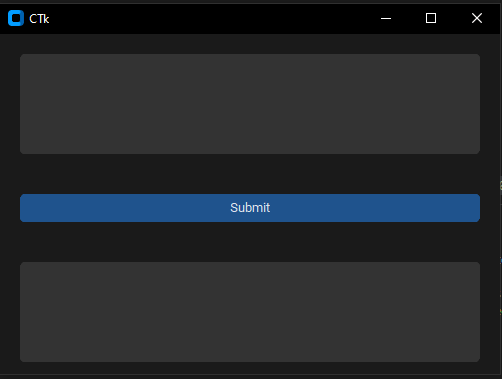

<!DOCTYPE html>
<html lang="en">
<head>
  <meta charset="UTF-8">
  <meta name="viewport" content="width=device-width, initial-scale=1.0">
</head>
<body>
  <h1>Stunning Chatbot</h1>
  
This project is a simple UI that uses OpenAI's text completion API to generate responses based on user input. To get started, follow the steps below:

  <ol>
    <li>Clone the repository from GitHub by running the following command:</li>
  </ol>
  <code style="text-align: center;">git clone https://github.com/your-username/your-repo.git</code>
  <ol start="2">
    <li>Install the necessary requirements by running the following command:</li>
  </ol>
  <code style="text-align: center;">pip install -r requirements.txt</code>
  
Note: You will need to set up your OpenAI API key before running the program. See the OpenAI documentation for instructions on how to do this.

  <h2>Customization</h2>
  
To customize the program, you can modify the <code>process_input</code> function to change how user input is processed, or you can modify the UI by changing the    <code>CTk</code> objects.

  <h2>Screenshot</h2>
  
</body>
</html>

